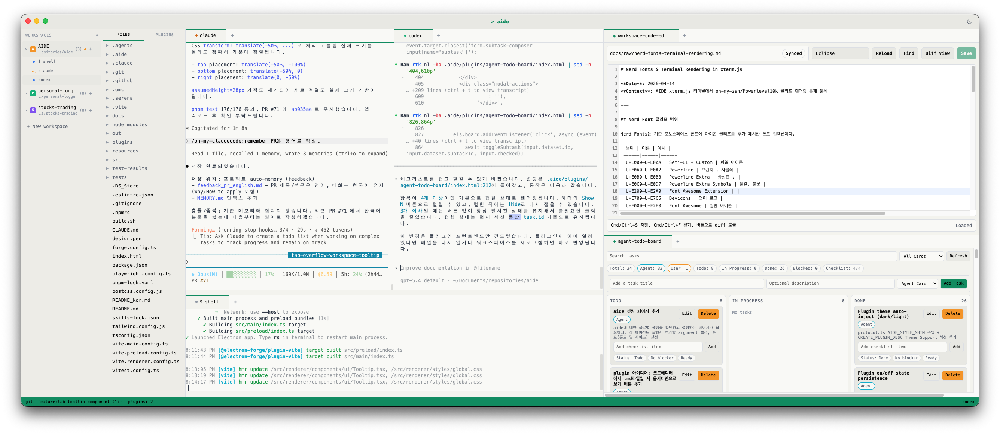
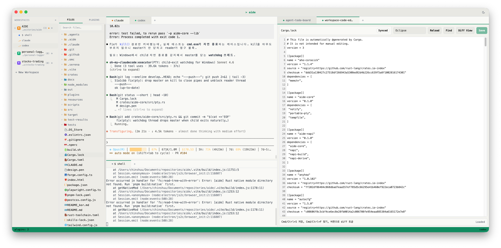
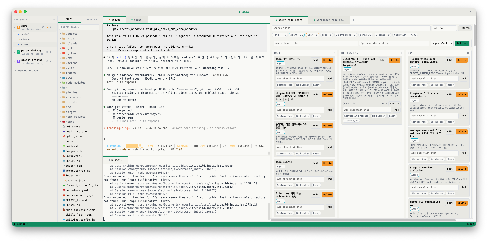
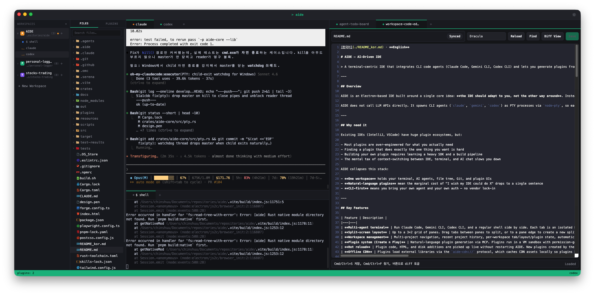

[한국어](./README_kor.md) · **English**

<p align="center">
  
</p>

# smalti — AI-Driven IDE

> A terminal-centric IDE that integrates CLI code agents (Claude Code, Gemini CLI, Codex CLI) and lets you generate plugins from natural language via the **Create n Play** system.

> 🎨 **Rebrand in progress**: Product name transitioning from AIDE to **smalti** (Italian for *Byzantine glass mosaic tiles*) — code identifiers (protocols, env vars, package name) still use the legacy `aide` prefix and will migrate with v0.1.0 pending trademark clearance. See [`docs/ideation/rebrand-smalti.md`](docs/ideation/rebrand-smalti.md).

---

## Overview

smalti is an Electron-based IDE built around a single core idea: **the IDE should adapt to you, not the other way around**. Instead of installing dozens of pre-built plugins from a marketplace, you describe what you want in natural language and an AI agent generates a working plugin instantly. The plugin runs in a sandboxed environment, registers itself as an AI tool, and is immediately usable both by you and by the AI assistant.

<p align="center">
  
  <br/>
  <sub><em>A typical workspace: multi-agent terminals, code editor pane, and a plugin-rendered kanban board — all in one window.</em></sub>
</p>

smalti does not call LLM APIs directly. It spawns CLI agents (`claude`, `gemini`, `codex`) as PTY processes via a Rust `portable-pty`-backed native module, so each agent manages its own authentication and you keep full control of your provider relationships.

---

## Why need it

Existing IDEs (IntelliJ, VSCode) have huge plugin ecosystems, but:

- Most plugins are over-engineered for what you actually need
- Finding a plugin that does exactly the one thing you want is hard
- Building your own plugin requires learning a heavy SDK and a build pipeline
- The mental tax of context-switching between IDE, terminal, and AI chat slows you down

smalti collapses this stack:

- **One workspace** holds your terminal, AI agents, file tree, and plugin UIs
- **Natural-language plugins** mean the marginal cost of "I wish my IDE could do X" drops to a single sentence
- **CLI-first** means you bring your own agent and your own auth — no vendor lock-in

---

## Key Features

| Feature | Description |
|---|---|
| **Multi-agent terminal** | Run Claude Code, Gemini CLI, Codex CLI, and a regular shell side by side. Each tab is an isolated PTY session with full ANSI color, status detection, and session save/resume. |
| **Split-screen layout** | Up to a 3×2 grid of panes. Drag tabs between panes to split, or to a pane edge to create a new split. Layout persists per workspace. |
| **Workspace management** | Multi-project navigation, recent project history, per-workspace tab/layout/plugin state, automatic restoration on launch. |
| **Plugin system (Create n Play)** | Natural-language plugin generation via MCP. Plugins run in a VM sandbox with permission-gated filesystem access and render their UI as iframe tabs. |
| **Hot reload** | Plugin code, HTML, and disk additions are picked up live without restarting smalti. New plugins created by the AI appear in the panel instantly. |
| **Offline CDN** | Plugins load external libraries via the `aide-cdn://` protocol, which caches CDN assets locally so plugins keep working offline. |
| **Agent status indicators** | Real-time visual feedback (idle / processing / awaiting input) for every agent session, surfaced in the workspace navbar. |
| **Theme system** | Dark and light themes with smooth transitions, JetBrains Mono typography, agent-specific accent colors. |
| **Rust core** | File system, watcher, and PTY operations run in a Rust `portable-pty` + `notify` native module (napi-rs). Idle CPU dropped from ~127% to ~0% on packaged builds; Korean / emoji terminal output no longer corrupts at read boundaries. |

<p align="center">
  
  <br/>
  <sub><em>Split-screen layout: an agent session on the left, code editing on the right. Drag tabs between panes to rearrange on the fly.</em></sub>
</p>

---

## Key Features — Plugin Creation

smalti plugins are created entirely through natural language conversation with an AI agent. There is no manual SDK, no boilerplate generator, no build step.

### The Create n Play flow

```
You:    "Make a plugin that highlights unused TypeScript imports
         and lets me delete them with one click."

Agent:  (uses MCP aide_create_plugin tool)
        → generates plugin.spec.json (id, name, permissions, tools)
        → generates plugin source code (CommonJS module)
        → generates index.html UI with smalti design tokens
        → registers as an MCP tool the agent itself can later invoke

smalti: Plugin appears in the Plugins panel. Toggle ON to activate.
        Click "Open as tab" to render its UI inside a pane.
```

### Plugin anatomy

```
.aide/plugins/my-plugin/
├── plugin.spec.json   # id, name, permissions, tools
├── tool.json          # tool manifest exposed to MCP
├── src/index.js       # CommonJS module: invoke(toolName, args)
├── index.html         # iframe UI (auto-injected window.aide shim)
├── mcp/               # MCP-specific assets
└── skill/             # skill assets
```

### Sandbox guarantees

- Plugins run in `node:vm` contexts — no access to `child_process`, `net`, or unrestricted `fs`
- `require('fs')` is gated by the plugin's declared permissions (`fs:read`, `fs:write`) and scoped to the workspace
- Iframe UIs run with `sandbox="allow-scripts"` on the custom `aide-plugin://` origin (their own opaque origin, isolated from the host app)
- External libraries must be loaded via `aide-cdn://` from an allowlisted CDN host

### Plugin scopes

Plugins are **workspace-local**. Each plugin lives under `<workspace>/.aide/plugins/<plugin-id>/` and is visible only in that workspace. Runtime-added plugins (via MCP, file manager, or direct copy) are auto-discovered without restart.

<p align="center">
  
  <br/>
  <sub><em>A plugin generated from natural language (<code>agent-todo-board</code>) rendering its UI as a full pane, alongside the agent session that created it.</em></sub>
</p>

---

## Installation

### Requirements

- **macOS** (Apple Silicon or Intel) — Windows / Linux: source install works (CI validates all 3 OSes); packaged DMG releases are currently macOS-only.
- **Node.js** ≥ 18
- **pnpm** (the project uses `node-linker=hoisted`, so npm/yarn will not work as-is)
- **Rust** (rustup with stable ≥ 1.82) — required for the Rust core. `pnpm install` auto-builds it. If rustup isn't present: `curl --proto '=https' --tlsv1.2 -sSf https://sh.rustup.rs | sh`. If Homebrew rustc is also installed, the build script prepends `~/.cargo/bin` to PATH so rustup takes priority — no manual action needed.

### Optional CLI agents

smalti detects installed agents automatically. Install whichever you use:

```bash
# Claude Code
npm install -g @anthropic-ai/claude-code

# Gemini CLI
npm install -g @google/gemini-cli

# Codex CLI
npm install -g @openai/codex
```

Each CLI manages its own authentication (`claude login`, `gemini auth`, etc.).

### Run from source

```bash
git clone https://github.com/Achelous1/smalti.git
cd smalti
pnpm install   # also runs a postinstall hook that builds the Rust native module
               # via scripts/build-native.mjs; first install compiles aide-core +
               # aide-napi (~30s); subsequent installs use cargo cache
pnpm start     # dev server with HMR
```

### Build a distributable

```bash
sh build.sh   # macOS — produces out/AIDE.dmg
```

The build script handles dependency install, lint, package, and DMG creation with a drag-and-drop installer layout. It also runs `pnpm run build:native:universal` to produce a lipo-merged arm64 + x64 universal binary, so the DMG runs on both Apple Silicon and Intel Macs.

### macOS Gatekeeper (unsigned build)

The distributed DMG is not code-signed, so macOS quarantines it on first launch ("smalti is damaged and can't be opened"). After dragging smalti into `/Applications`, strip the quarantine attribute:

```bash
xattr -c /Applications/AIDE.app
```

Then launch smalti normally.

---

## Architecture

smalti follows Electron's three-process model with strict security boundaries.

```
┌──────────────────────────────────────────────────────────┐
│                       Renderer Process                    │
│  React + TypeScript + Tailwind + Zustand                  │
│  ┌─────────────┐ ┌────────────┐ ┌──────────────────────┐ │
│  │ Workspace   │ │ Pane Tree  │ │ Plugin iframes        │ │
│  │ Nav         │ │ (split)    │ │ (aide-plugin://)      │ │
│  └─────────────┘ └────────────┘ └──────────────────────┘ │
│           ↑                   ↓                            │
│           └─── window.aide ───┘  (contextBridge)           │
└──────────────────────────────────────────────────────────┘
                            ↕  IPC
┌──────────────────────────────────────────────────────────┐
│                       Preload Script                      │
│  Exposes a typed API surface to the renderer               │
└──────────────────────────────────────────────────────────┘
                            ↕  IPC
┌──────────────────────────────────────────────────────────┐
│                       Main Process (Node.js)             │
│  ┌─────────────┐ ┌────────────┐ ┌──────────────────────┐ │
│  │ Terminal    │ │ Plugin     │ │ MCP Server           │ │
│  │ (Rust PTY)  │ │ Registry   │ │ (NDJSON over stdio)  │ │
│  └─────────────┘ └────────────┘ └──────────────────────┘ │
│  ┌─────────────┐ ┌────────────┐ ┌──────────────────────┐ │
│  │ FS Watcher  │ │ VM Sandbox │ │ Custom Protocols     │ │
│  │(Rust notify)│ │            │ │ (aide-plugin/cdn)    │ │
│  └─────────────┘ └────────────┘ └──────────────────────┘ │
└──────────────────────────────────────────────────────────┘
  Backend ops (FS, watcher, PTY) route through
  crates/aide-core + crates/aide-napi → .node loaded by Main process.
```

### Security boundaries

- `contextIsolation: true`, `nodeIntegration: false` in all renderer windows
- All Node.js access goes through the preload script's `contextBridge`
- Plugin iframes are served by a custom `aide-plugin://` protocol so they get their own opaque origin
- CDN assets are proxied through `aide-cdn://` with a hostname allowlist and on-disk cache
- Plugin VM sandboxes have an explicit `require()` shim that only allows `path` and a permission-gated `fs`

<p align="center">
  
  <br/>
  <sub><em>File explorer, terminal, and Markdown rendering in adjacent panes — navigate and edit project docs without leaving the IDE.</em></sub>
</p>

---

## Tech Stack

| Layer | Technology |
|---|---|
| **Shell** | Electron + electron-forge (Vite plugin) |
| **UI** | React 19, TypeScript 5, Tailwind CSS 3 |
| **State** | Zustand 5 |
| **Terminal** | xterm.js + Rust portable-pty (napi-rs) |
| **Rust core** | napi-rs (crates/aide-core, crates/aide-napi) — FS, watcher, PTY |
| **Persistence** | electron-store (per-workspace sessions) |
| **Plugin sandbox** | Node.js `vm` module with scoped `require` |
| **Custom protocols** | `aide-plugin://`, `aide-cdn://` |
| **Testing** | Vitest (unit), Playwright (E2E) |
| **Package manager** | pnpm (`node-linker=hoisted`) |
| **Typography** | JetBrains Mono (primary), IBM Plex Mono (secondary) |

---

## MCP Integration

smalti ships with an embedded **Model Context Protocol** server that exposes plugin tools to any MCP-aware agent.

### What the MCP server does

When smalti starts, it writes a self-contained MCP server script to `~/.aide/aide-mcp-server.js` and registers it in each agent's global config. The MCP server remains Node.js-hosted because it executes plugin JavaScript via `node:vm`.

| Agent | Config file | Format |
|---|---|---|
| Claude Code | `~/.claude.json` | JSON (`mcpServers` key) |
| Gemini CLI | `~/.gemini/settings.json` | JSON (`mcpServers` key) |
| Codex CLI | `~/.codex/config.toml` | TOML (`[mcp_servers.aide]`) |

The server runs as a standalone Node process per agent invocation and speaks NDJSON over stdio.

### Built-in tools

| Tool | Purpose |
|---|---|
| `aide_create_plugin` | Generate a new plugin from a natural-language description (creates spec, code, HTML, registers tools) |
| `aide_edit_plugin` | Patch an existing plugin's code, HTML, or spec in place |
| `aide_delete_plugin` | Remove a plugin and clean up its files |
| `aide_list_plugins` | List all installed plugins with their tools |
| `aide_invoke_tool` | Call any plugin tool from the agent |

### Dynamic tool registration

Every plugin's declared `tools` are automatically exposed under the namespace `plugin_<plugin-name>_<tool-name>`. When you create a plugin called `json-formatter` with a `format` tool, the agent immediately gets a callable tool named `plugin_json-formatter_format` — no restart needed.

### Plugin → smalti → Plugin call chain

```
User → Agent: "Format this JSON file"
Agent → MCP: plugin_json-formatter_format({path: "data.json"})
MCP → Plugin sandbox: invoke("format", {path: "data.json"})
Plugin → fs (scoped): readFileSync, JSON.parse, JSON.stringify, writeFileSync
Plugin → return: {success: true, lines: 42}
MCP → Agent: tool result
Agent → User: "Formatted 42 lines."
```

The same plugin's iframe UI can call `window.aide.invoke('json-formatter', 'format', {...})` from the browser side, and plugins can invoke each other's tools through the same channel.

---

## License

See [LICENSE](./LICENSE).

## Contributing

Issues and PRs welcome at [github.com/Achelous1/smalti](https://github.com/Achelous1/smalti).
