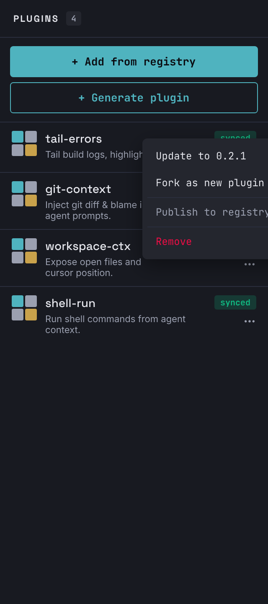
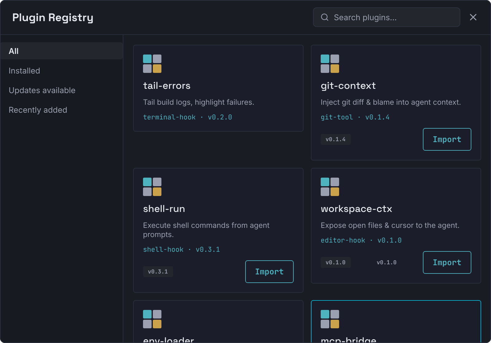
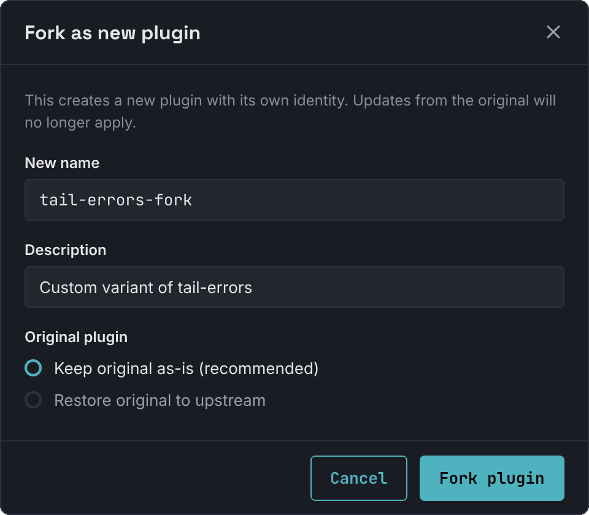
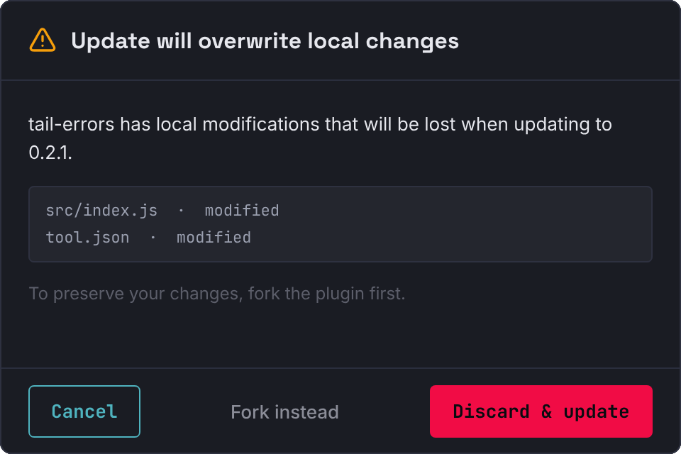
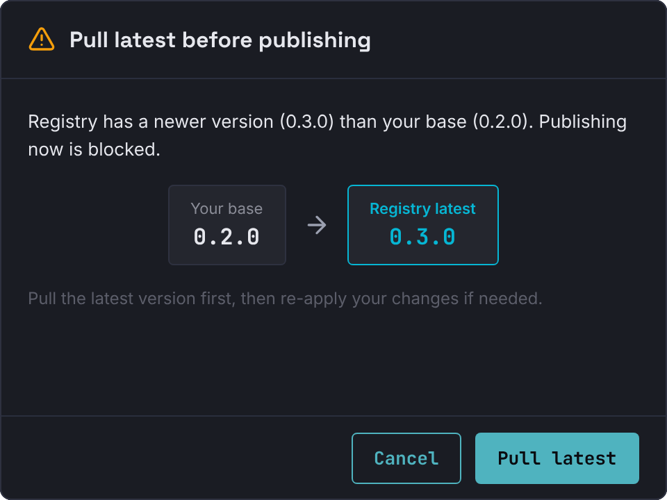

# Plugin Global Registry — Design Gallery

Phase 0 mockups for the plugin export/import + sync feature. Source design lives in `design.pen` (top-level frames listed below). Architecture spec is in [PLAN.md](./PLAN.md).

| # | Screen | Frame ID | File |
|---|--------|----------|------|
| 1 | PluginPanel v2 — status badges + action menu | `hyNsC` | [`plugin-panel-v2.png`](./plugin-panel-v2.png) |
| 2 | RegistryBrowser — global plugin list modal | `Ps3bS` | [`registry-browser.png`](./registry-browser.png) |
| 3 | Dialog — Fork as new plugin | `bFo2s` | [`dialog-fork-as-new-plugin.png`](./dialog-fork-as-new-plugin.png) |
| 4 | Dialog — Update confirm (with local changes warning) | `wjpkp` | [`dialog-update-confirm.png`](./dialog-update-confirm.png) |
| 5 | Dialog — Publish conflict (Pull-latest-first guard) | `eu08e` | [`dialog-publish-conflict.png`](./dialog-publish-conflict.png) |

---

## 1. PluginPanel v2

**File**: `plugin-panel-v2.png` · **Frame**: `hyNsC` (320 × 720)

Sidebar panel showing all workspace plugins with status badges and an action menu. Demonstrates all three states (`synced` / `update-available` / `locally-modified`) on different rows.

**Spec reference**: PLAN.md → D3 (status classification), D6 (Fork action entry)

---

## 2. RegistryBrowser

**File**: `registry-browser.png` · **Frame**: `Ps3bS` (800 × 560)

Modal launched from the PluginPanel "Add from registry" button. Shows global registry plugins with category filters; already-installed plugins are flagged.

**Spec reference**: PLAN.md → "Import 시" flow

---

## 3. Dialog: Fork as new plugin

**File**: `dialog-fork-as-new-plugin.png` · **Frame**: `bFo2s` (480 × 420)

Triggered when the user wants to permanently keep workspace-specific changes. Creates a new plugin with its own `pluginId` (no shared upstream). The original can be kept as-is or restored to upstream.

**Spec reference**: PLAN.md → D6 ("Fork as new plugin" flow)

---

## 4. Dialog: Update confirm

**File**: `dialog-update-confirm.png` · **Frame**: `wjpkp` (480 × 320)

Shown when the user clicks "Update" on a plugin that has local modifications. Lists the modified files and offers a "Fork instead" path so changes aren't silently lost.

**Spec reference**: PLAN.md → "업데이트 감지 & 적용" step 4

---

## 5. Dialog: Publish conflict

**File**: `dialog-publish-conflict.png` · **Frame**: `eu08e` (480 × 360)

Blocks publish when the registry latest is newer than the workspace base — typically the multi-machine case where another instance published first. Forces the user to pull latest before re-attempting.

**Spec reference**: PLAN.md → "Publish 흐름" step 4

---

## Open Design Questions

1. **Generic Badge component** — current status badges are ad-hoc; `tI5AW` Badge-New is hardcoded crimson. Worth adding a Badge variant that takes a color variable.
2. **PluginCard width variant** — `35BEn` is locked at 260px which breaks RegistryBrowser's `fill_container` grid; consider a `fill_container` variant.
3. **Danger button variant** — "Discard & update" uses Button-Primary with a crimson `fill` override. A dedicated `smalti-Button-Danger` would be cleaner.
4. **Row hover state** — only mocked via the floating menu in PluginPanel v2; final implementation should add a row background highlight.
